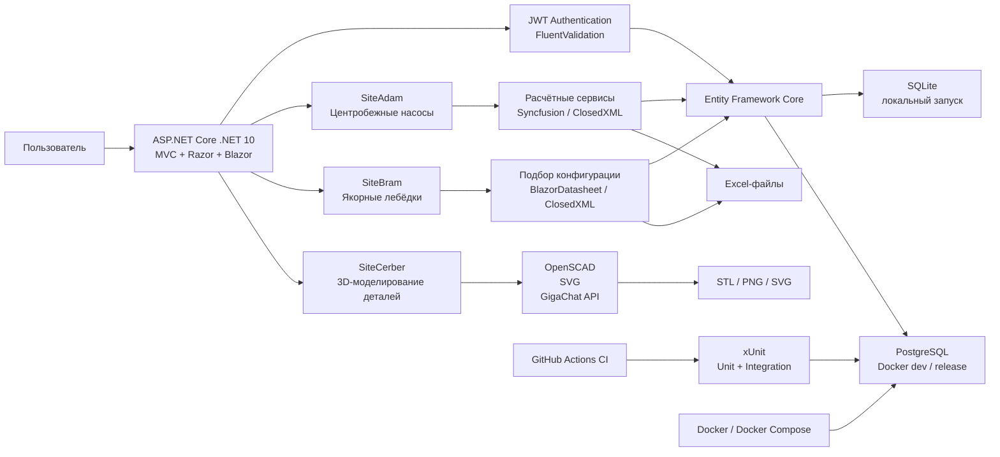

# Архитектура проекта — краткая схема

```mermaid
flowchart LR

    User["Пользователь"]

    User --> Web["ASP.NET Core .NET 10<br/>MVC + Razor + Blazor"]

    Web --> Auth["JWT Authentication<br/>FluentValidation"]

    Web --> Adam["SiteAdam<br/>Центробежные насосы"]
    Web --> Bram["SiteBram<br/>Якорные лебёдки"]
    Web --> Cerber["SiteCerber<br/>3D-моделирование деталей"]

    Adam --> AdamServices["Расчётные сервисы<br/>Syncfusion / ClosedXML"]
    Bram --> BramServices["Подбор конфигурации<br/>BlazorDatasheet / ClosedXML"]
    Cerber --> CerberServices["OpenSCAD<br/>SVG<br/>GigaChat API"]

    AdamServices --> Data["Entity Framework Core"]
    BramServices --> Data
    Auth --> Data

    Data --> SQLite["SQLite<br/>локальный запуск"]
    Data --> PostgreSQL["PostgreSQL<br/>Docker dev / release"]

    CerberServices --> Files["STL / PNG / SVG"]
    AdamServices --> Excel["Excel-файлы"]
    BramServices --> Excel

    CI["GitHub Actions CI"] --> Tests["xUnit<br/>Unit + Integration"]
    Tests --> PostgreSQL

    Docker["Docker / Docker Compose"] --> PostgreSQL
```
