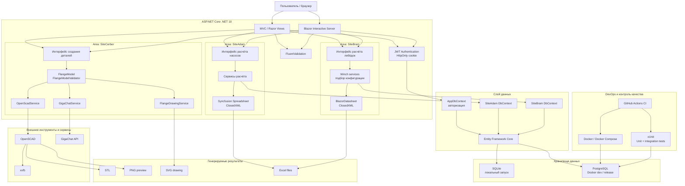

# Общая архитектура проекта

```mermaid
flowchart TB

    User["Пользователь / браузер"]

    subgraph APP["ASP.NET Core .NET 10"]
        MVC["MVC / Razor Views"]
        Blazor["Blazor Interactive Server"]
        Auth["JWT Authentication<br/>HttpOnly cookie"]
        Validation["FluentValidation"]

        subgraph ADAM["Area: SiteAdam"]
            AdamUI["Интерфейс расчёта насосов"]
            AdamService["Сервисы расчёта"]
            AdamExcel["Syncfusion Spreadsheet<br/>ClosedXML"]
        end

        subgraph BRAM["Area: SiteBram"]
            BramUI["Интерфейс расчёта лебёдок"]
            BramService["Winch services<br/>подбор конфигурации"]
            BramExcel["BlazorDatasheet<br/>ClosedXML"]
        end

        subgraph CERBER["Area: SiteCerber"]
            CerberUI["Интерфейс создания деталей"]
            Flange["FlangeModel<br/>FlangeModelValidator"]
            OpenScadService["OpenScadService"]
            DrawingService["FlangeDrawingService"]
            GigaService["GigaChatService"]
        end
    end

    User --> MVC
    User --> Blazor

    MVC --> Auth
    Blazor --> Auth

    MVC --> Validation
    Blazor --> Validation

    MVC --> AdamUI
    MVC --> BramUI
    MVC --> CerberUI

    Blazor --> AdamUI
    Blazor --> BramUI
    Blazor --> CerberUI

    AdamUI --> AdamService
    AdamService --> AdamExcel

    BramUI --> BramService
    BramService --> BramExcel

    CerberUI --> Flange
    Flange --> OpenScadService
    Flange --> DrawingService
    Flange --> GigaService

    subgraph DATA["Слой данных"]
        EF["Entity Framework Core"]
        BaseDb["AppDbContext<br/>авторизация"]
        AdamDb["SiteAdam DbContext"]
        BramDb["SiteBram DbContext"]
    end

    Auth --> BaseDb
    AdamService --> AdamDb
    BramService --> BramDb

    BaseDb --> EF
    AdamDb --> EF
    BramDb --> EF

    subgraph STORAGE["Хранилища данных"]
        SQLite["SQLite<br/>локальный запуск"]
        PostgreSQL["PostgreSQL<br/>Docker dev / release"]
    end

    EF --> SQLite
    EF --> PostgreSQL

    subgraph EXTERNAL["Внешние инструменты и сервисы"]
        OpenSCAD["OpenSCAD"]
        Xvfb["xvfb"]
        GigaChat["GigaChat API"]
    end

    OpenScadService --> OpenSCAD
    OpenSCAD --> Xvfb
    GigaService --> GigaChat

    subgraph OUTPUT["Генерируемые результаты"]
        STL["STL"]
        PNG["PNG preview"]
        SVG["SVG drawing"]
        ExcelFiles["Excel files"]
    end

    OpenSCAD --> STL
    OpenSCAD --> PNG
    DrawingService --> SVG
    AdamExcel --> ExcelFiles
    BramExcel --> ExcelFiles

    subgraph DEVOPS["DevOps и контроль качества"]
        Docker["Docker / Docker Compose"]
        Tests["xUnit<br/>Unit + Integration tests"]
        CI["GitHub Actions CI"]
    end

    Docker --> PostgreSQL
    Tests --> PostgreSQL
    CI --> Tests
    CI --> Docker
```
