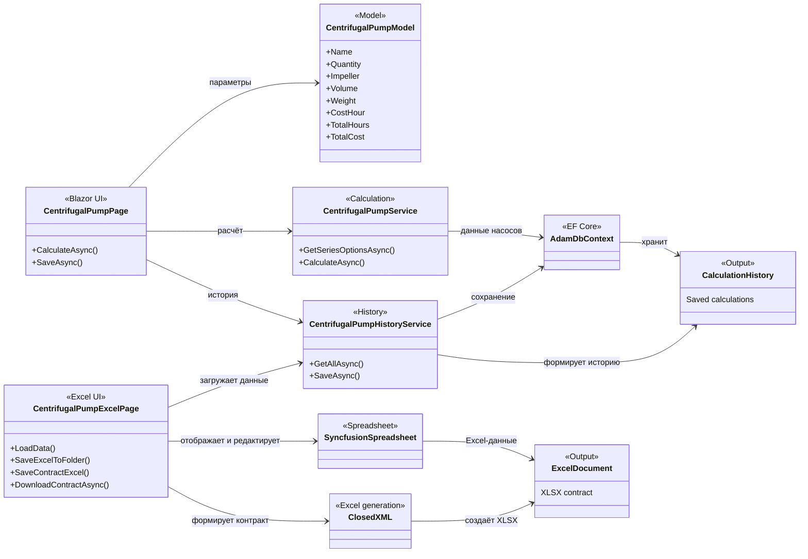

# SiteAdam — UML для презентации

```mermaid
classDiagram
direction LR

class CentrifugalPumpPage {
    <<Blazor UI>>
    +CalculateAsync()
    +SaveAsync()
}

class CentrifugalPumpModel {
    <<Model>>
    +Name
    +Quantity
    +Impeller
    +Volume
    +Weight
    +CostHour
    +TotalHours
    +TotalCost
}

class CentrifugalPumpService {
    <<Calculation>>
    +GetSeriesOptionsAsync()
    +CalculateAsync()
}

class CentrifugalPumpHistoryService {
    <<History>>
    +GetAllAsync()
    +SaveAsync()
}

class CentrifugalPumpExcelPage {
    <<Excel UI>>
    +LoadData()
    +SaveExcelToFolder()
    +SaveContractExcel()
    +DownloadContractAsync()
}

class AdamDbContext {
    <<EF Core>>
}

class SyncfusionSpreadsheet {
    <<Spreadsheet>>
}

class ClosedXML {
    <<Excel generation>>
}

class CalculationHistory {
    <<Output>>
    Saved calculations
}

class ExcelDocument {
    <<Output>>
    XLSX contract
}

CentrifugalPumpPage --> CentrifugalPumpModel : параметры
CentrifugalPumpPage --> CentrifugalPumpService : расчёт
CentrifugalPumpPage --> CentrifugalPumpHistoryService : история

CentrifugalPumpService --> AdamDbContext : данные насосов

CentrifugalPumpHistoryService --> AdamDbContext : сохранение
CentrifugalPumpHistoryService --> CalculationHistory : формирует историю
AdamDbContext --> CalculationHistory : хранит

CentrifugalPumpExcelPage --> CentrifugalPumpHistoryService : загружает данные
CentrifugalPumpExcelPage --> SyncfusionSpreadsheet : отображает и редактирует
CentrifugalPumpExcelPage --> ClosedXML : формирует контракт

ClosedXML --> ExcelDocument : создаёт XLSX
SyncfusionSpreadsheet --> ExcelDocument : Excel-данные
```
