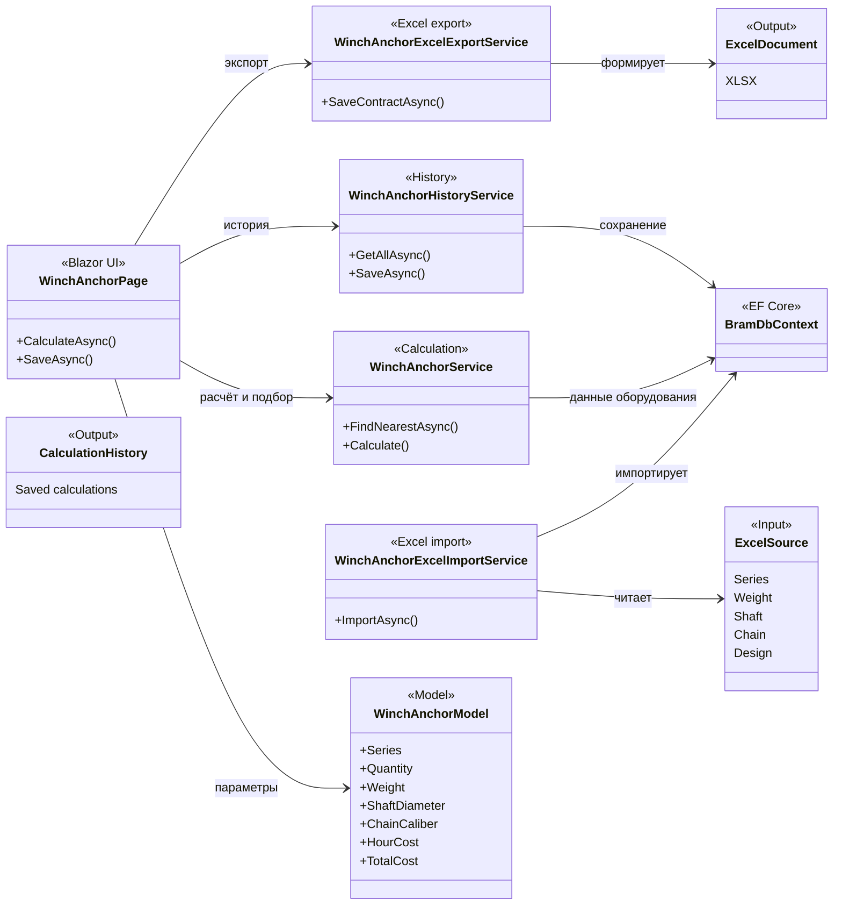

# SiteBram — UML для презентации

```mermaid
classDiagram
direction LR

class WinchAnchorPage {
    <<Blazor UI>>
    +CalculateAsync()
    +SaveAsync()
}

class WinchAnchorModel {
    <<Model>>
    +Series
    +Quantity
    +Weight
    +ShaftDiameter
    +ChainCaliber
    +HourCost
    +TotalCost
}

class WinchAnchorService {
    <<Calculation>>
    +FindNearestAsync()
    +Calculate()
}

class WinchAnchorHistoryService {
    <<History>>
    +GetAllAsync()
    +SaveAsync()
}

class WinchAnchorExcelImportService {
    <<Excel import>>
    +ImportAsync()
}

class WinchAnchorExcelExportService {
    <<Excel export>>
    +SaveContractAsync()
}

class BramDbContext {
    <<EF Core>>
}

class ExcelSource {
    <<Input>>
    Series
    Weight
    Shaft
    Chain
    Design
}

class CalculationHistory {
    <<Output>>
    Saved calculations
}

class ExcelDocument {
    <<Output>>
    XLSX
}

WinchAnchorPage --> WinchAnchorModel : параметры
WinchAnchorPage --> WinchAnchorService : расчёт и подбор
WinchAnchorPage --> WinchAnchorHistoryService : история
WinchAnchorPage --> WinchAnchorExcelExportService : экспорт

WinchAnchorService --> BramDbContext : данные оборудования
WinchAnchorHistoryService --> BramDbContext : сохранение

WinchAnchorExcelImportService --> ExcelSource : читает
WinchAnchorExcelImportService --> BramDbContext : импортирует

WinchAnchorExcelExportService --> ExcelDocument : формирует
```
