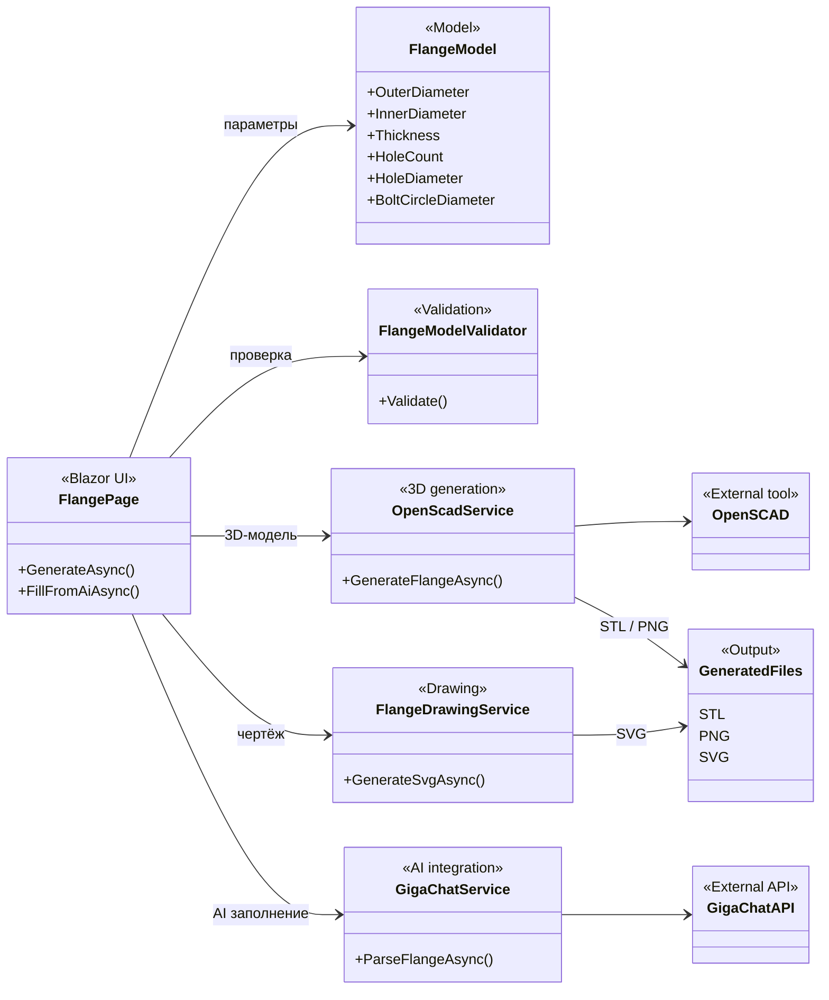

# SiteCerber — UML для презентации

```mermaid
classDiagram
direction LR

class FlangePage {
    <<Blazor UI>>
    +GenerateAsync()
    +FillFromAiAsync()
}

class FlangeModel {
    <<Model>>
    +OuterDiameter
    +InnerDiameter
    +Thickness
    +HoleCount
    +HoleDiameter
    +BoltCircleDiameter
}

class FlangeModelValidator {
    <<Validation>>
    +Validate()
}

class OpenScadService {
    <<3D generation>>
    +GenerateFlangeAsync()
}

class FlangeDrawingService {
    <<Drawing>>
    +GenerateSvgAsync()
}

class GigaChatService {
    <<AI integration>>
    +ParseFlangeAsync()
}

class OpenSCAD {
    <<External tool>>
}

class GigaChatAPI {
    <<External API>>
}

class GeneratedFiles {
    <<Output>>
    STL
    PNG
    SVG
}

FlangePage --> FlangeModel : параметры
FlangePage --> FlangeModelValidator : проверка

FlangePage --> OpenScadService : 3D-модель
FlangePage --> FlangeDrawingService : чертёж
FlangePage --> GigaChatService : AI заполнение

OpenScadService --> OpenSCAD
GigaChatService --> GigaChatAPI

OpenScadService --> GeneratedFiles : STL / PNG
FlangeDrawingService --> GeneratedFiles : SVG
```
